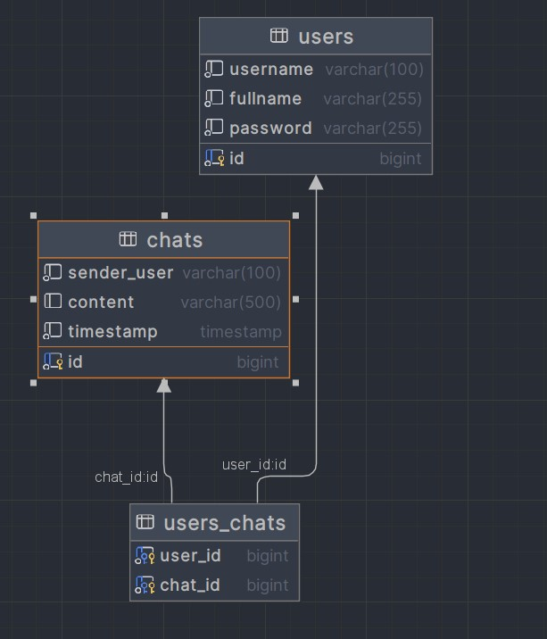

# SimpleChat
This API allows customers to create a simple chat with general chatroom

___
# Table diagrams
Simple action to edit the note:

We have two main classes - User and Chat.

The users table representation of user in this application. User can registration and use it as Basic Authentication

The chats table represents chat in this application. In chat user can send a message, get all messages and delete user's message.

___

# Environments

To run this application you need to create `.env` file in root directory with next environments:
* `POSTGRES_HOST` - host of Postgresql database
* `POSTGRES_PORT` - port of Postgresql database
* `POSTGRES_USERNAME` - username for Postgresql database
* `POSTGRES_PASSWORD` - password for Postgresql database
* `POSTGRES_DATABASE` - name of Postgresql database
* `POSTGRES_SCHEMA` - name of Postgresql schema

___

# How to run the service

1. You need to have Docker Engine and Docker Compose on your machine (or Docker Desktop).
2. Add `.env` file in application directory and wrote all above environments with variable.
3. After you finish the 1st and 2nd points you can download this application and do "docker compose up" in the application directory.
4. The post method "/user" endpoint create a user for application with the next parameters: username, fullname and password.
5. The post method "/message/{username}/send" endpoint allows us to send a message to chat. The request need username and password as Basic Auth.
6. The get method "/message" endpoint get all message from chat with next parament: username, content and time. The request need username and password as Basic Auth.
7. The post method "/message/{username}/delete" endpoint allows us to delete our message from chat. The request need username and password as Basic Auth. Also need to know that request don't let us delete other message except our.
8. After you finish the job, press "CTRL+C" for stopping docker container.

Also, I add a json file to Postman app [simple chat.postman_collection.json](simple%20chat.postman_collection.json).
